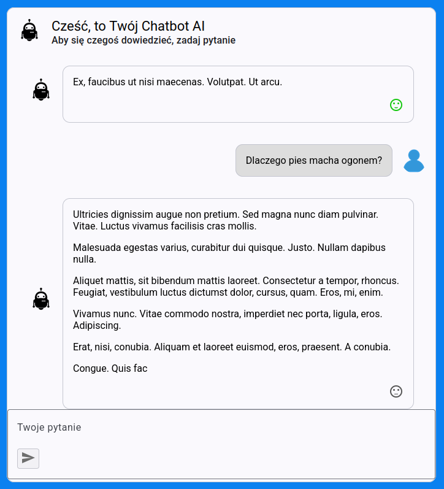

# Chatbot-AIv

Chatbot-AI to aplikacja, która symuluje prostego asystenta AI. Dostępne funkcjonalności:
* wyświetlanie historii chatu
* ocena odpowiedzi wygenerowanych przez asystenta
* anulowanie wyświetlania odpowiedzi przez asystenta

## Wymagania wstępne

* Sklonowanie projektu dostępnego w serwisie GitHub (ścieżka do repozytorium: https://github.com/dmajkowska/ChatbotAI)
* połączenie SQL Server 
* Visual Studio 2022
* zainstalowane Node.js v20.16.0
* zainstalowane npm v11.0.0

## Inicjalizacja bazy danych

* Jeszcze przed uruchomieniu backendu należy utworzyć lub zaktualizować bazę danych
* W tym celu twórz plik appsettings.json w projekcie ChatbotAI.Backend\ChatbotAI.API i zedytuj wartość ConnectionStrings/DefaultConnection zgodnie z ustawieniami serwera bazy danych
* Następnie z linii poleceń udajemy się do katalogu ChatbotAI.Backend\ChatbotAI.API i uruchamiamy komendę:
```bash
dotnet ef database update
```
* Baza danych powinna się poprawnie utworzyć

## Uruchomienie backendu

* Uruchom Visual Studio 2022
* otwórz solucję ChatbotAI.Backend.sln z lokalizacji  ChatbotAI.Backend
* otwórz plik appsettings.json w projekcie ChatbotAI.Backend\ChatbotAI.API i zedytuj wartość ConnectionStrings/DefaultConnection zgodnie z ustawieniami serwera bazy danych
* uruchom aplikację
* otwórz Swagger API w przeglądarce internetowej https://localhost:7004/index.html


## Uruchomienie frontendu

* uruchamy consolę za pomocą komendy w linii poleceń
```bash
npm install
npm run build
npm start
```
* otwieramy aplikację na stronie internetowej http://localhost:4200/

## Zrzuty ekranu

Poniżej znajdują się zrzuty ekranu GUI oraz tabeli z danymi:




Copyright 2025 @ Dagna Majkowska


