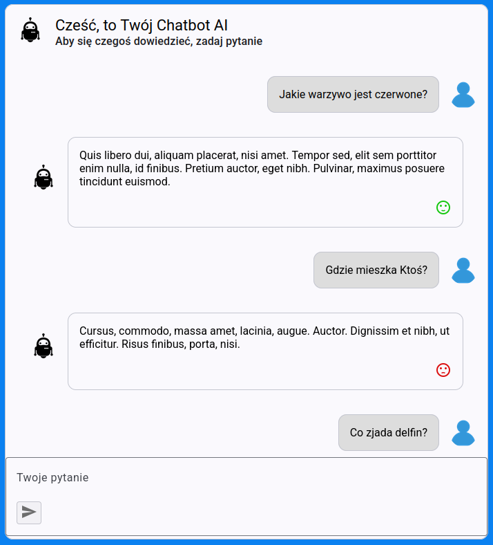
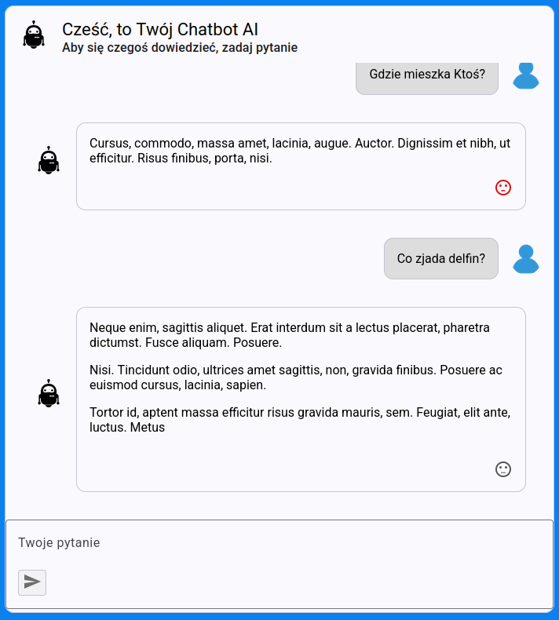

# Chatbot-AI

Chatbot-AI to aplikacja, która symuluje prostego asystenta AI. Dostępne funkcjonalności:
* Wyświetlanie historii chatu
* Ocena odpowiedzi wygenerowanych przez asystenta
* Możliwość przerwania wyświetlania odpowiedzi przez asystenta

## Wymagania wstępne

* Sklonowanie projektu dostępnego w serwisie GitHub (ścieżka do repozytorium: https://github.com/dmajkowska/ChatbotAI)
* Połączenie SQL Server 
* Visual Studio 2022
* Zainstalowane Node.js v20.16.0
* Zainstalowane npm v11.0.0


## Uruchomienie backendu

* Uruchom Visual Studio 2022
* Otwórz solucję ChatbotAI.Backend.sln z lokalizacji  ChatbotAI.Backend
* Otwórz plik appsettings.json w projekcie ChatbotAI.Backend\ChatbotAI.API i zedytuj wartość ConnectionStrings/DefaultConnection zgodnie z ustawieniami serwera bazy danych
* Uruchom aplikację
* Otwórz Swagger API w przeglądarce internetowej http://localhost:7004/index.html


## Uruchomienie frontendu

* Uruchom consolę za pomocą komendy w linii poleceń
```bash
npm install
npm run build
npm start
```
* Otwórz aplikację na stronie internetowej http://localhost:4200/

## Zrzuty ekranu

Poniżej znajdują się zrzuty ekranu GUI oraz tabeli z danymi:






Copyright 2025 @ Dagna Majkowska


