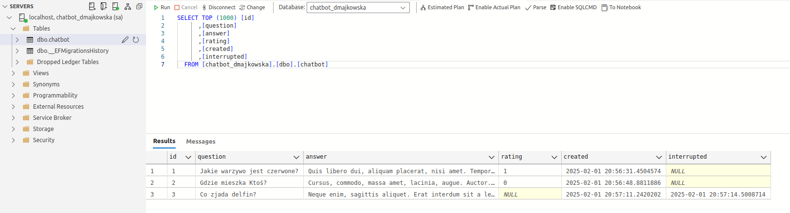

# Chatbot-AI

Chatbot-AI to aplikacja, która symuluje prostego asystenta AI. Dostępne funkcjonalności:
* wyświetlanie historii chatu
* ocena odpowiedzi wygenerowanych przez asystenta
* anulowanie wyświetlania odpowiedzi przez asystenta

## Wymagania wstępne

* Sklonowanie projektu dostępnego w serwisie GitHub (ścieżka do repozytorium: https://github.com/dmajkowska/ChatbotAI)
* połączenie SQL Server 
* Visual Studio 2022
* zainstalowane Node.js v20.16.0
* zainstalowane npm v11.0.0


## Uruchomienie backendu

* Uruchom Visual Studio 2022
* otwórz solucję ChatbotAI.Backend.sln z lokalizacji  ChatbotAI.Backend
* otwórz plik appsettings.json w projekcie ChatbotAI.Backend\ChatbotAI.API i zedytuj wartość ConnectionStrings/DefaultConnection zgodnie z ustawieniami serwera bazy danych
* uruchom aplikację
* otwórz Swagger API w przeglądarce internetowej https://localhost:7004/index.html

## Inicjalizacja bazy danych

* Po uruchomieniu backendu baza powinna utworzyć się automatycznie, nic nie trzeba dodatkowo robić
* w celu zweryfikowania poprawności działania bazy danych uruchom Microsoft SQL Management Studio połącz się z serwerem bazy danych zgodnie z 
* powinny się utworzyć baza danych o nazwie chatbot_dmajkowska zawierająca pustą tabelę dbo.chat
* tabela dbo.chatbot powinna zawierać następujące kolumny oraz primary key 
  * [id] [int] IDENTITY(1,1) NOT NULL,
  * [question] [nvarchar](500) NOT NULL,
  * [answer] [nvarchar](max) NOT NULL,
  * [rating] [bit] NULL,
  * [created] [datetime2](7) NOT NULL,
  * [interrupted] [datetime2](7) NULL,

## Uruchomienie frontendu

* uruchamy consolę za pomocą komendy cmd
```bash
npm install
npm run build
npm start
```
* otwieramy aplikację na stronie internetowej http://localhost:4200/

## Zrzuty ekranu

Poniżej znajdują się zrzuty ekranu GUI oraz tabeli z danymi:




Copyright 2025 @ Dagna Majkowska


